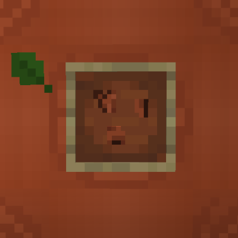
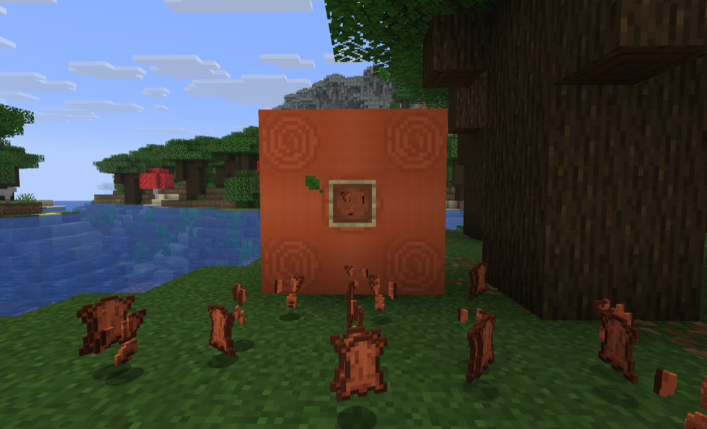

# More Leather

A Fabric mod that makes leather more accessible and useful by renaming/reskinning rabbit hide into "Leather Scraps," adding a decorative Block of Leather, and adding a wide set of data-driven recipes for turning leather items into scraps and back.

## Screenshots

## Features

### Renamed Item
- **Rabbit Hide** → **Leather Scraps** (name and texture overridden for Pandorical clients; see below)
- The vanilla recipe still works: 4 Leather Scraps = 1 Leather

### Block of Leather
- Craft 9 leather into a decorative **Block of Leather** (leather roll)
- Directional placement like logs
- Decompresses back to 9 leather

### Deconstruction Recipes
Break down leather items into scraps (shapeless crafting):

| Item | → Scraps |
|------|----------|
| Leather Helmet | 15 |
| Leather Chestplate | 24 |
| Leather Leggings | 21 |
| Leather Boots | 12 |
| Leather Horse Armor | 21 |
| Leather | 4 |
| Book | 3 |
| Item Frame | 3 |
| Glow Item Frame | 3 |
| Book and Quill | 3 |
| Written Book | 3 |
| Bundle | 3 |
| Saddle | 9 |
| Harness (all colors) | 6 |

### New Crafting Recipes
- **Saddle**: 3 leather + 2 string + 2 iron ingots
- **Leather Horse Armor**: 7 leather

### Smelting Recipes
- **Rotten Flesh** → Leather Scraps (furnace or smoker, 0.1 XP)

### Animal/Mob Leather Drops
Animals and undead drop leather and/or leather scraps on death, and fishing junk turns up 1-2 scraps half the time.

| Animal | Leather | Scraps |
|--------|---------|--------|
| Cat, Ocelot, Fox, Wolf | 0-1 | 0-2 |
| Pig, Sheep, Goat | 0-1 | 1-3 |
| Strider | 0-1 | 1-2 |
| Polar Bear, Panda, Sniffer | 1-2 | 1-3 |
| Camel | 1-2 | 1-2 |
| Cow, Horse, Donkey, Mule, Llama, Trader Llama | vanilla | 1-2 |
| Mooshroom, Hoglin | vanilla | 2-4 |
| Ravager | 2-3 | 2-4 |
| Bat | — | 0-1 |
| Zombie, Drowned, Zombie Villager | — | 0-1 |
| Husk | — | 0-2 |

A zombie, husk, drowned, zombie villager, skeleton, stray, wither skeleton, piglin or zombified piglin wearing leather armour drops extra scraps for each piece worn: helmet 4, chestplate 6, leggings 5, boots 3.

## Learning It

Rotten flesh cooks down into hide. That is the best idea here and it is invisible: a furnace gives no hint what it will accept, and the thing every player has too much of is the last thing anyone would think to put in one.

With [village-quests](https://github.com/fatlard1993/village-quests) installed, a leatherworker teaches the trade in five lessons, in the order somebody would need them: four scraps (what the unit is), four leather got without killing anything (where the trick is said out loud), a book (what is already made of hide), a pair of leather boots unpicked in front of you for twelve scraps (what unpicking costs), and last a full block of leather. Nine leather is past the point where "there is another way to get this" stops being trivia. Graduating leaves you a block of leather to keep.

Optional and guarded: without village-quests the mod behaves exactly as before.

## Pandorical

More Leather registers the Block of Leather's block/item models and renames + reskins vanilla rabbit hide into "Leather Scraps" through Pandorical's content sync, including `overrideVanillaItem` for the rabbit hide rename.

**The Pandorical mod must be installed client-side** to see the Block of Leather rendered and the "Leather Scraps" name/texture on rabbit hide. Without it, the underlying items and recipes still work, but a connecting client sees vanilla names/textures (e.g. "Rabbit Hide" instead of "Leather Scraps") and the Block of Leather may not render correctly.

## Development

Installing is in [DEVELOPMENT.md](DEVELOPMENT.md).

## License

MIT, see [LICENSE](LICENSE).
